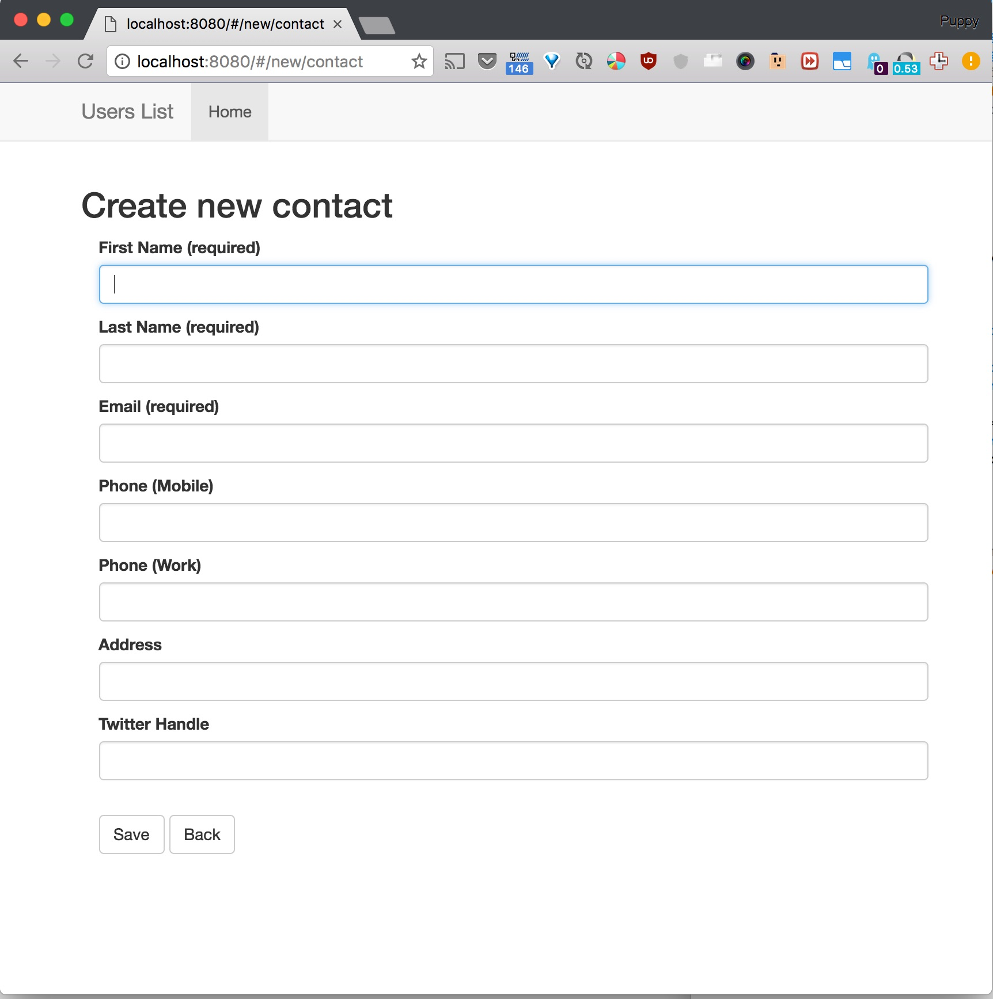
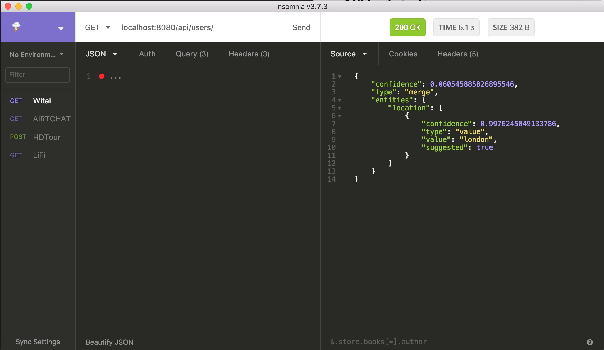

# TravelBot-Server



Server and dashboard for the TravelBot app

## Technologies

- Node
- Express
- Mongo
- Angular

## Get Started

1. Git clone this repo

2. Run nodemon server.js

3. Run ngrok https 8080


## API Endpoints



- GET POST PUT DELETE /api/users
- GET POST PUT DELETE /api/deals


## TODOs

- [ ] Setup Express with API endpoints
- [ ] Connect to MongoDB for data store

User object

```
{
  name: 'Kate Monster',
  FacebookID: '1234567890',
	home_airports: [
		{
			code: 'SFO',
			city: 'San Francisco'
		},
		{
			code: 'OAK',
			city: 'Oakland'
	],
	destination_airports: [
		{
			code: 'JFK',
			city: 'New York City'
		},
		{
			code: 'LON',
			city: 'London',
		}
	],
	notifications_rate: 'daily'
}
```
