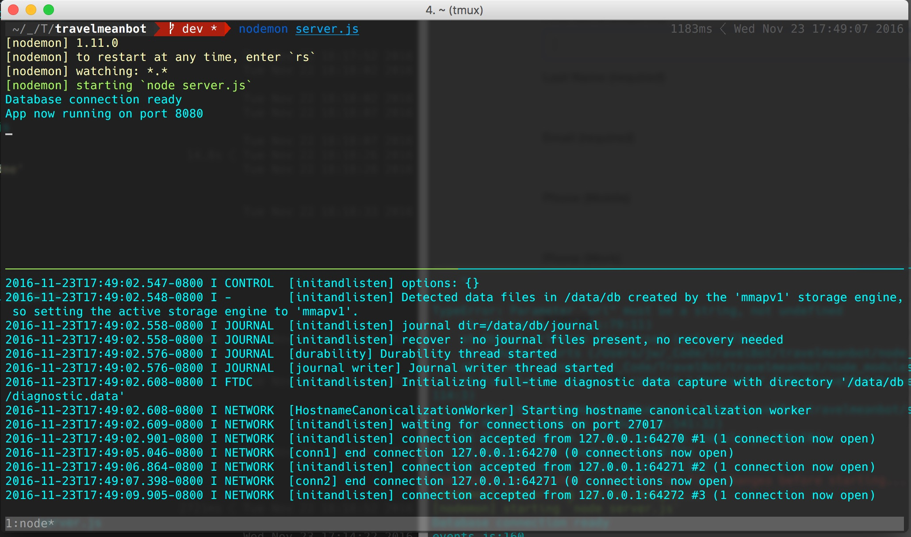

# TravelBot-Server


Server and dashboard for the TravelBot app

## Technologies

- Node
- Express
- Mongo
- Angular

## Get Started



1. Git clone this repo

2. Run ```mongod```

2. Run ```nodemon server.js```

3. Run ```ngrok https 8080```


## API Endpoints


- GET POST PUT DELETE /api/users
- GET POST PUT DELETE /api/deals


## TODOs

- [ ] Setup Express with API endpoints
- [ ] Connect to MongoDB for data store
